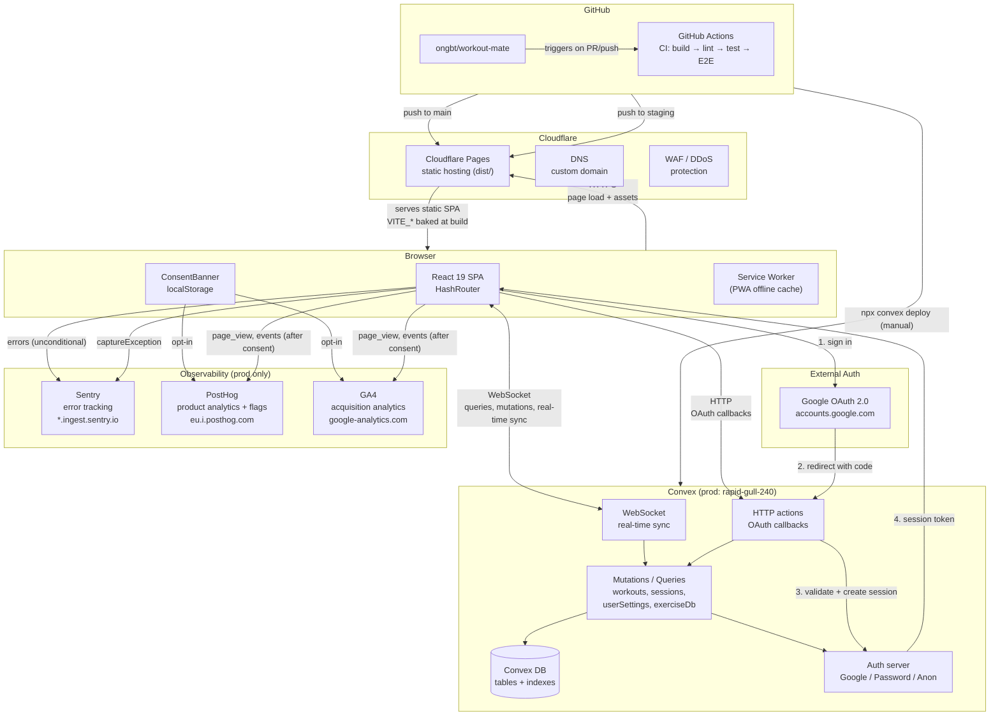

# System Architecture — Workout Mate

## Overview

Workout Mate is a single-page application for tracking workouts. React 19 frontend hosted on Cloudflare Pages, Convex backend (serverless functions + real-time database), with Google OAuth for authentication and a consent-gated observability stack.

## Component interaction diagram



**Key interaction paths:**

| #   | Path                       | Protocol       | Initiated by                         | Consent-gated            |
| --- | -------------------------- | -------------- | ------------------------------------ | ------------------------ |
| 1   | Browser → Cloudflare Pages | HTTPS          | Page load / navigation               | No                       |
| 2   | Browser ↔ Convex           | WebSocket      | App mount (live queries, mutations)  | No (auth required)       |
| 3   | Browser → Convex HTTP      | HTTPS          | OAuth callback redirects             | No                       |
| 4   | Browser → Google           | HTTPS redirect | Sign-in button                       | No                       |
| 5   | Browser → Sentry           | HTTPS POST     | Error boundary, manual capture       | No (legitimate interest) |
| 6   | Browser → PostHog          | HTTPS POST     | Page view, feature flag eval, events | **Yes**                  |
| 7   | Browser → GA4              | HTTPS (gtag)   | Page view, acquisition events        | **Yes**                  |
| 8   | GitHub → Cloudflare Pages  | API            | Push to main/staging                 | N/A                      |
| 9   | CLI → Convex               | API            | `npx convex deploy` (manual)         | N/A                      |

## Environment matrix

| Environment | Frontend                         | Backend (Convex)                             | Env file          |
| ----------- | -------------------------------- | -------------------------------------------- | ----------------- |
| Local dev   | `localhost:5173` (Vite)          | `dev:resolute-wildcat-738`                   | `.env.local`      |
| Staging     | Cloudflare Pages preview         | `dev:resolute-wildcat-738` (shared with dev) | `.env.staging`    |
| Production  | Cloudflare Pages (custom domain) | `prod:rapid-gull-240`                        | `.env.production` |

Convex provides exactly two deployments per project: dev and prod. Staging shares the dev backend.

## Frontend (React 19 + Vite + TypeScript)

### Key dependencies

- `convex` + `@convex-dev/auth` — backend client + auth provider
- `react-router` (HashRouter) — client-side routing (hash-based to avoid Cloudflare Pages SPA redirect issues with OAuth callbacks)
- `@sentry/react` — error boundary + manual error capture
- `posthog-js` — product analytics + feature flags
- `tailwindcss` — styling

### Build & deploy

- Build command: `pnpm build` (runs `tsc -b && vite build`)
- Output: `dist/`
- Cloudflare Pages auto-deploys on push to `main` (prod) and all other branches (preview)
- `VITE_*` env vars are inlined at build time — changing them requires a new commit + push
- Env vars are set in Cloudflare Pages dashboard (not in repo `.env` files), separately for preview and production

### CSP headers

Set via `<meta http-equiv="Content-Security-Policy">` in `Layout.tsx`:

| Directive     | Allowlist                                                                                                                                                                  |
| ------------- | -------------------------------------------------------------------------------------------------------------------------------------------------------------------------- |
| `script-src`  | `'self'`, `googletagmanager.com`, `eu-assets.i.posthog.com`                                                                                                                |
| `connect-src` | `'self'`, `wss://*.convex.cloud`, `https://*.convex.cloud`, `accounts.google.com`, `google-analytics.com`, `analytics.google.com`, `*.ingest.sentry.io`, `*.i.posthog.com` |
| `img-src`     | `'self'`, `data:`, `google-analytics.com`, `google.com`                                                                                                                    |

### Consent gating

- `ConsentBanner` component shown on first visit
- GA4 and PostHog initialize only after user opts in
- Sentry initializes unconditionally (legitimate interest for service reliability)
- Consent state persisted in `localStorage`

### Routing

HashRouter is used instead of BrowserRouter because Cloudflare Pages does not support SPA fallback rewrites. OAuth callback query parameters survive hash routing (they're in the fragment).

## Backend (Convex)

### Schema (`convex/schema.ts`)

- `users` — auth-linked user profiles (via `@convex-dev/auth`)
- `sessions` — auth sessions
- `authAccounts` — linked OAuth accounts
- `authRefreshTokens` — refresh token storage
- `authVerificationCodes` — email/password verification
- `authVerifiers` — OAuth state nonces
- `workouts` — user workout data (exercises, sets, reps, weight, etc.)
- `defaultWorkouts` — seed/default workout templates
- `userSettings` — per-user settings (e.g., RapidAPI key)
- `exerciseLibrary` — cached exercise DB entries

### Modules

| File                     | Purpose                                                |
| ------------------------ | ------------------------------------------------------ |
| `convex/auth.ts`         | Multi-provider auth: Google, Password, Anonymous       |
| `convex/auth.config.ts`  | Auth provider configuration                            |
| `convex/http.ts`         | HTTP router (OAuth callbacks via `auth.addHttpRoutes`) |
| `convex/workouts.ts`     | CRUD for workout data                                  |
| `convex/sessions.ts`     | Session tracking (start/end workout sessions)          |
| `convex/userSettings.ts` | User preferences storage                               |
| `convex/exerciseDb.ts`   | Exercise DB search proxy + cache                       |
| `convex/validators.ts`   | Shared Zod-style validators (via `convex/values`)      |
| `convex/schema.ts`       | Table definitions                                      |

### Auth flow

1. User clicks sign in → Google OAuth popup
2. Google redirects to `https://rapid-gull-240.convex.site/api/auth/callback/google`
3. Convex `http.ts` routes to `@convex-dev/auth` handler
4. Token validation + session creation
5. Client receives session via Convex WebSocket

### Server-side env vars (per deployment)

Set via `npx convex env set`:

- `SITE_URL` — dev: `http://localhost:5173`, prod: custom domain
- `AUTH_GOOGLE_ID` / `AUTH_GOOGLE_SECRET` — Google OAuth client credentials
- `AUTH_SECRET` — session signing secret
- `JWT_KID` / `JWT_PRIVATE_KEY` / `JWKS` — JWT signing for custom tokens

### Seeding

No built-in deploy hook. Seed via:

- Client-side `useEffect` on first load (idempotent, checks for existing data)
- Manual: `npx convex run module:seedFunction --prod`

## CI/CD (GitHub Actions)

Trigger: PR or push to `main` or `staging`

```
check job:
  pnpm install --frozen-lockfile
  pnpm build          (tsc -b + vite build)
  pnpm lint
  pnpm format:check
  pnpm test -- run

e2e job (depends on check):
  pnpm install --frozen-lockfile
  pnpm exec playwright install --with-deps chromium firefox
  pnpm test:e2e
  (upload Playwright report on failure)
```

## Observability stack

| Service | Purpose                           | Consent-gated            | Dev      | Staging  | Prod    |
| ------- | --------------------------------- | ------------------------ | -------- | -------- | ------- |
| Sentry  | Error tracking                    | No (legitimate interest) | Disabled | Disabled | Enabled |
| PostHog | Product analytics + feature flags | Yes                      | Disabled | Disabled | Enabled |
| GA4     | Acquisition analytics             | Yes                      | Disabled | Disabled | Enabled |

### Sentry

- SDK: `@sentry/react` (10.52.0)
- Init: `src/lib/sentry.ts` — reads `VITE_SENTRY_DSN`, no-ops if empty
- Loader: `SentryLoader` component in `main.tsx`
- Integration: `ErrorBoundary` captures React render errors, `ErrorContext` captures manual errors via `captureException` / `captureMessage`
- CSP: `*.ingest.sentry.io` + `*.ingest.us.sentry.io` in `connect-src`

### PostHog

- SDK: `posthog-js` (1.372.10)
- Init: `src/lib/posthog.ts` — reads `VITE_POSTHOG_KEY` + `VITE_POSTHOG_HOST`, no-ops if key missing
- Loader: `PostHogLoader` component in `main.tsx`
- Feature flags: `useFeatureFlag.ts` hook
- Session recording: disabled by default, opt-in via config change
- Host: `https://eu.i.posthog.com`
- CSP: `eu-assets.i.posthog.com` (script-src), `*.i.posthog.com` (connect-src)

### GA4

- Implementation: manual gtag.js injection (no npm dependency)
- Init: `src/lib/analytics.ts` — reads `VITE_GA_MEASUREMENT_ID`, no-ops if empty
- Loader: `GA4Loader` component in `main.tsx`
- Pattern: dataLayer queued events before script load; gtag.js replays on arrival
- Measurement ID: `G-GLX188REZK` (prod only)
- CSP: `googletagmanager.com` (script-src), `google-analytics.com` + `analytics.google.com` (connect-src)

### Consent flow

```
App mount
  ├─ SentryLoader → Sentry.init() [always, if DSN set]
  ├─ Check localStorage for consent
  │   ├─ No consent stored → show ConsentBanner
  │   │   ├─ User accepts → init GA4 + PostHog, store consent
  │   │   └─ User declines → store refusal, don't load
  │   └─ Consent stored → init GA4 + PostHog [if previously accepted]
  └─ GA4Loader / PostHogLoader → no-op if consent not given
```

## Staging workflow

```
feature branch
  → PR to staging
    → CI (build, lint, format, test, E2E)
    → merge
      → Cloudflare Pages preview deploy (uses dev Convex backend)
      → validate on preview URL
        → PR staging → main
          → merge
            → Cloudflare Pages prod deploy (main branch)
            → npx convex deploy (backend to prod)
```

Staging shares dev Convex. Backend changes to dev affect staging immediately. The preview URL is `https://staging.<project>.pages.dev`.

## Custom domain

Set in Cloudflare Dashboard > Pages > project > Custom domains. DNS must be on Cloudflare. `VITE_CONVEX_URL` stays the same (`rapid-gull-240.convex.cloud`) — the frontend domain is independent of the Convex backend URL.

## Google OAuth configuration

Single OAuth 2.0 client covers all environments.

**Authorized JavaScript origins**:

- `http://localhost:5173`
- `https://staging.<project>.pages.dev`
- `https://<custom-domain>.com`

**Authorized redirect URIs**:

- `https://resolute-wildcat-738.convex.site/api/auth/callback/google`
- `https://rapid-gull-240.convex.site/api/auth/callback/google`

URIs must be exact — no wildcards. Consent screen must be published (not "Testing") for production users.
